# 20210526 Notes appendix learning

##### 绪论

- IOS

IOS Operating system 26% market

iPhone OS IOS 4

2016 Watch OS

2019 iPad OS » mouse click

IOS 14 nw


- Xcode

12.4 version

IDE


Welcome page:

open a project

create a project

Copy a project

&

Recent projects

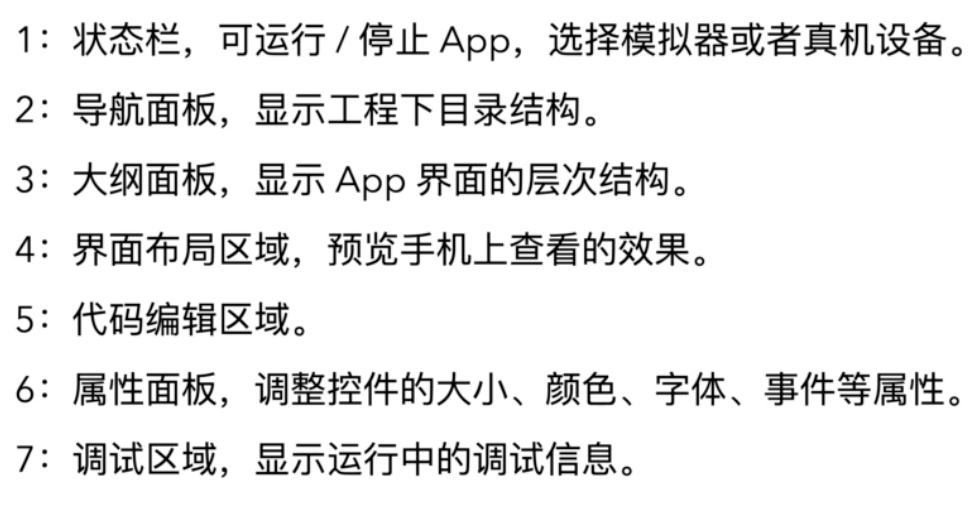

- Swift

language for MacOS IOS iPadOS WatchOS TvOS

2014 published 

5.4 --version


dev Languages :

Objective C

Swift


Needs:

Xcode

MacOS

IOS device 


Features : (pros)

Lean of syntax

security data type

Functionalize to improve efficiency 


Cons:

lack of Rumtime mechanism like in OC (dynamic and static language)

Older version Apps using OC


- Lean of syntax

e.g.

```print("Hello world.")```

**Variables and const**

```swift
var a = 1
let b = 2
```


Camel-Case驼峰式命名

`thisNumber`


Basic type:

Int

String

Double

Float

Bool

Once declared, type not change any more

e.g.```var num: Int = 0```


Different type can not operated across

Int + Double ❌

(Double)Int + Double ✅

⬆️temporary


- functional programming 

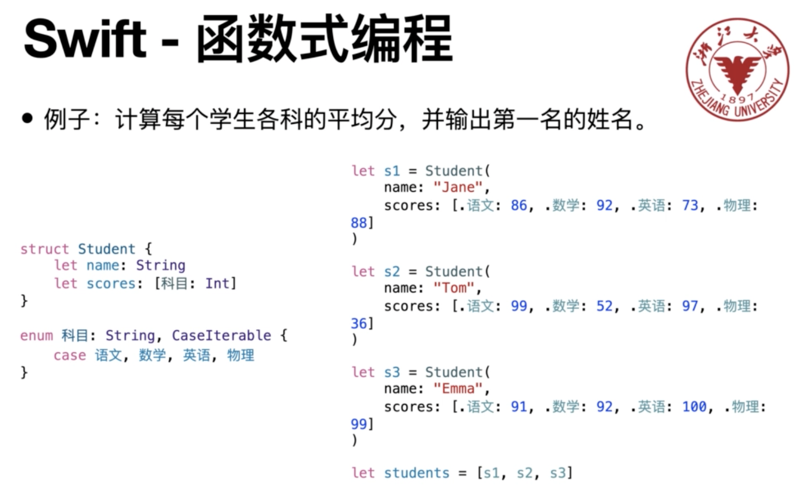

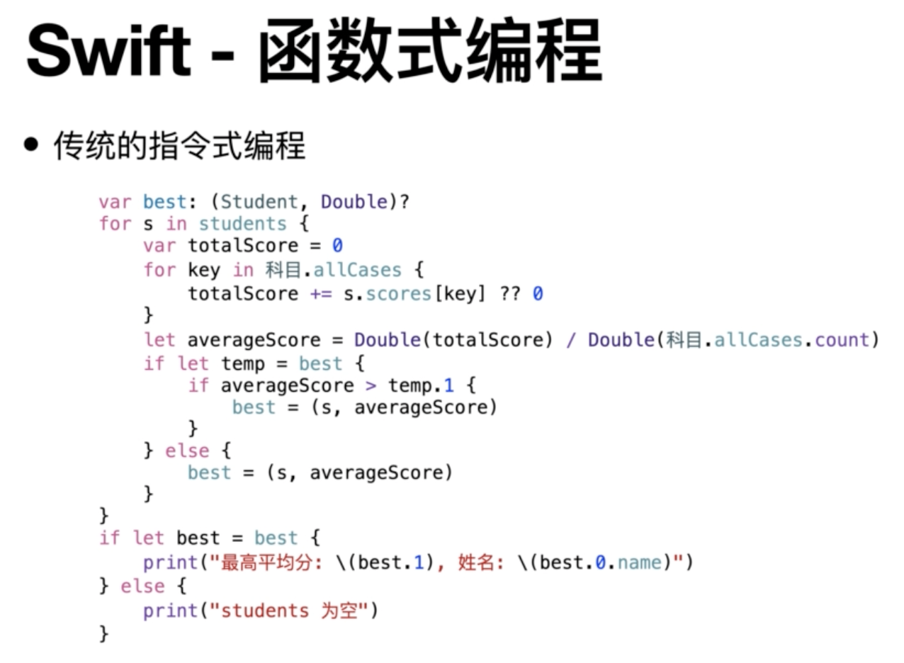

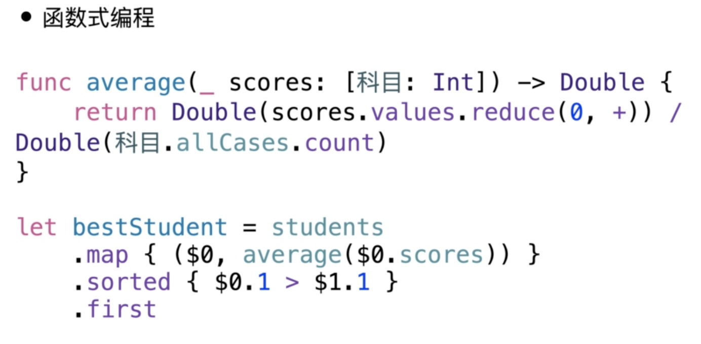

struct	*** {

var ** : Type**

}

##### Materials

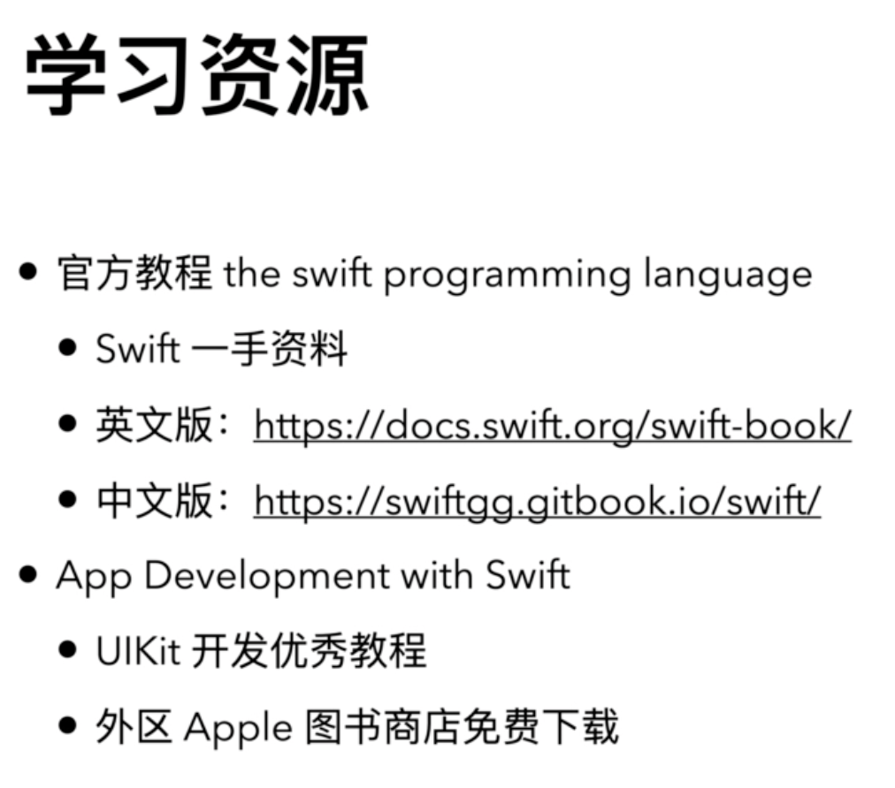

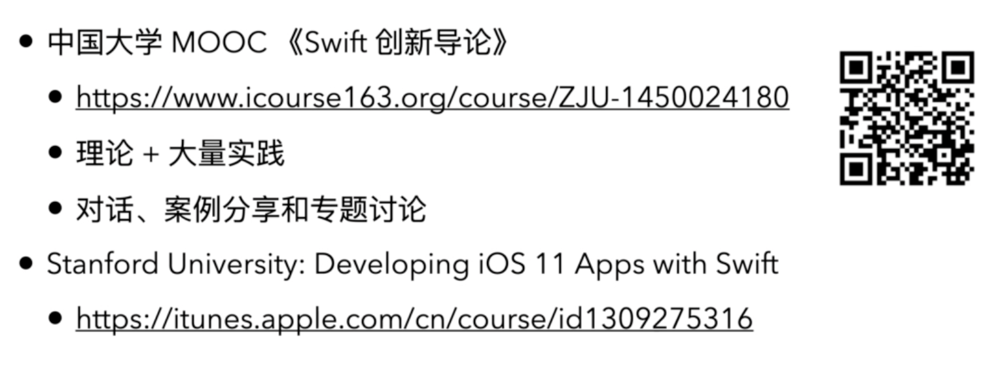


## Appendix 2 App Development with Swift

Language: Swift/OC

Tools: Xcode MacOS iOS device & cables


##### Materials:

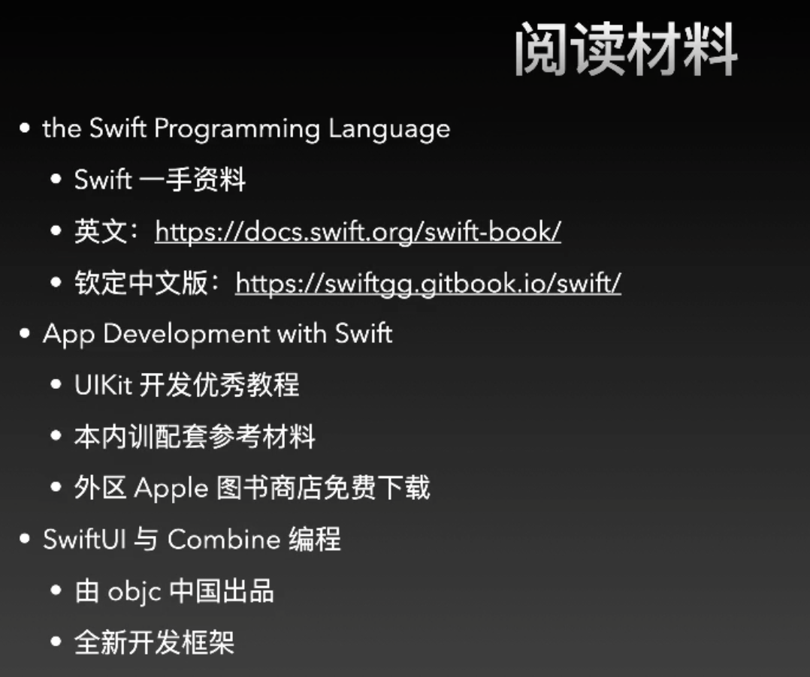

1. Swift Basic
   1. var let datatype operator
   2. control flow
   3. Array function method
2. Project 
   1. Xcode familiarising
   2. Application build and compile and debug
   3. interface builder basic


**Tips:** More learning more writing and coding

AVL tree data structure 

``` print("Hello world.")```

no need to write ; semicolon after each line


Const: let

Variables: var


Int Double String Bool


```let letName: Int = 0```

**Tips:** never rely on compiler to deside the type of let or var (data)


Operator:

+-*/

+= -= *= /=

&& || !

 == != >< >= <=

Condition ? Statement : statement2


Control Flow:

1

If *** {

}else if *** {

}else{

}


2 

Switch ** {

Case ** : **

...

Default: ***

}

Inside case:

e.g.  `case 0...9 : print("1") // Integer form 0 to 9`

no need `break;`


3 function 

func	functionName (parameters: Type, ...) -> returnType {

​	// body

} 

`functionName(parameters: 123) // need to parameters name`

占位符：

something like %s %c in C, just do it like this `"asd \(varName)"`


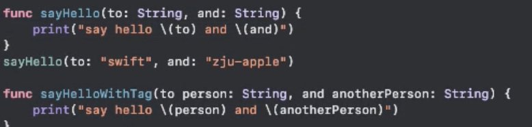

提高可读性

形式参数的标签

在形参前面加`_` 在调用函数的时候，实参前面就不用加形参名字和冒号


集合类型 Collection

array

Dictionary 

```swift
var aryName: [Int] = [
  1,2,23
]

aryName[index]

// .append capacity .contains .removeall .isempty 
```


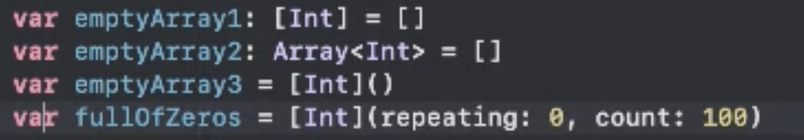


dictionary

Key-value 

not only use index to find value


```Swift 
```


强制解包 变量后面加！

优雅：if let

`dictionary["key"] = newValue`

`oldValue = scores.updateValue(100, forKey: "fad")`

` oldValue = scores.removeValue(forKey: "fad")`

直接移除用`dic["key"] = nil`


LOOP:

for in / while

e.g.

```Swift 
for index in 1..3 {
  print(index)
}

for - in 1..3 {
  print("whatever")
}

for letter in "ABCD" {
  print("\(letter)")
}

for (index, letter) in "ABCD".enumerated() {
  print("\(index): \(letter)")
}

for (name, score) in scores {
  print("\(name)'s score is \(score)'")
}
```


## Project practise -- Light

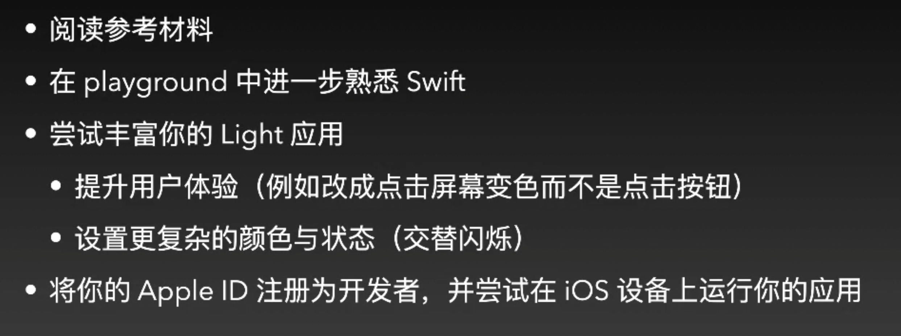


After updated to macOS Big Sur, when using git commands terminal prompt  up error messages like these:

xcrun: error: invalid active developer path (/Library/Developer/CommandLineTools), missing xcrun at: /Library/Developer/CommandLineTools/usr/bin/xcrun

（1）网络上给到解决办法是：

Searched solutions online following:

input command in terminal: ```Xcode-select --install```

Tips: this method can resolve most bad situations you goe stuck in

and other circumstances:

（2）如果你没有登录appId，可能会提示"不能安装该软件，因为当前无法从软件更新服务其获得"，需要登录appId即可

(3) 如果你登录之后还是无法提示无法下载，可以登录[https://git-scm.com/download](https://links.jianshu.com/go?to=https%3A%2F%2Fgit-scm.com%2Fdownload) 下载对应的git包，重新安装即可


# Appendix 2.1

introduction for playground, cuz I won't use it. skip this part

import and export playground code to Xcode project code

##### SwiftUI

2019 WWDC published

Tool kit to code front end of mobile client

drag

##### WWDC & MAIC

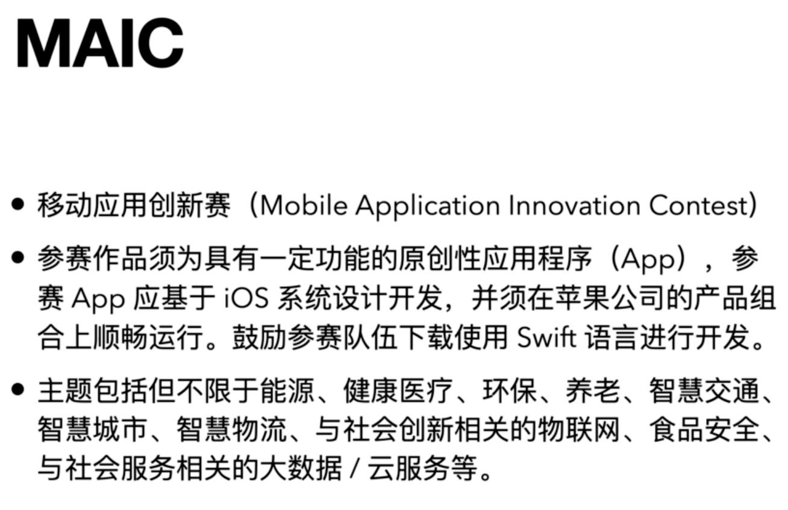

Playground 检视器会显示循环次数 n times

创建project

组织机构名字

storyboard

+symbol and drag in into storyboard and modify attributes on the right hand

Add event: code on the right added, then push ctrl and drag from button(tree) to code area OR right mouse drag into code area

# Appendix 2.2 Advanced Functions and struct UIKit -Controls Project 2

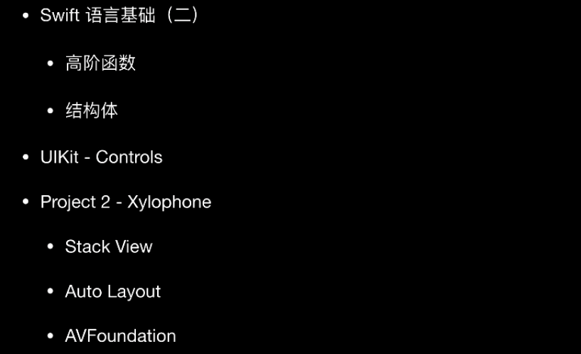


