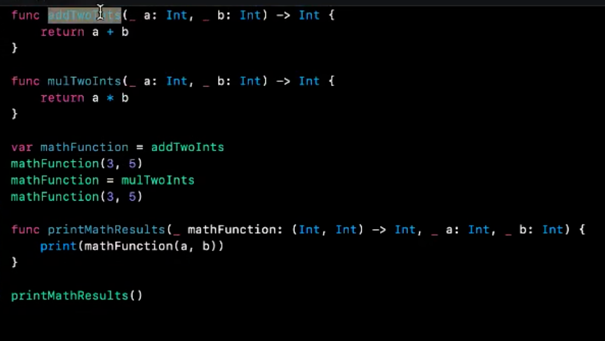

# 20210530 Notes

# Appendix 2



高阶函数

结构体

```Swift 
struct Person {
  	var name: String
  	var age: Int
  	func satsth(){
      print()
    }
}

var person = Person(name: "a", age: 12)
person.satsth()


```

多态初始化

解决数据同步 冲突

```Swift 
var Temperature {
  	var celsius: Double
  	var fahrenheit: Double {
      return celsius + 1.8 +32
    }
  	var kelvin : Double {
      return celsius + 273
    }
  
  	init(celsius: Double){
      self.celius = celsius
    }
  	
  	init(fahrenheit: Double) {
      celsius = fahrenheit - 32/1.8
    }
  
  	init(kelvin: Double){
      celsius = kelcin -273
    }
}

var temp = Temperature(celsius: 30)
var temp2 = Temperature(fahrenheit: 30)
var temp3 = Temperature(kelvin: 30)
```


- Mutating 关键字

```Swift 
struct Odomter {
   	var count: Int = 0
  
  	// 这里有点像java里面 类中static变量，随类产生和变化，不随对象变化。mutating 就是更改struct中的变量值
  	mutating func increment() {
      count += 1
    }
  
  	mutating func incrementByUser (amount: Int){
      count += amount
    }
}

var odometer  = Odometer (count: 20)
print(odometer.count)
odometer.increment()
print(odometer.count)


```


- 属性监视器

```Swift 
struct StepCounter {
  var totalStep: Int = 0{
    willSet {
      print("About to set totalStep to \(newValure)")
      didSet {
        if totolStep > oldValue {
          print("Added \(totalStep 	- oldValue) steps.")
        }
      }
    }
  }
 
}


var stepValue = StepCounter()
stepCounter.totalValue = 10
stepCounter.totalValue = 20

```


controls 介绍

控件 简述 见controls project