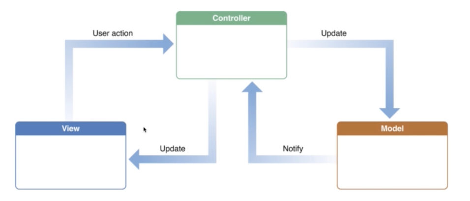
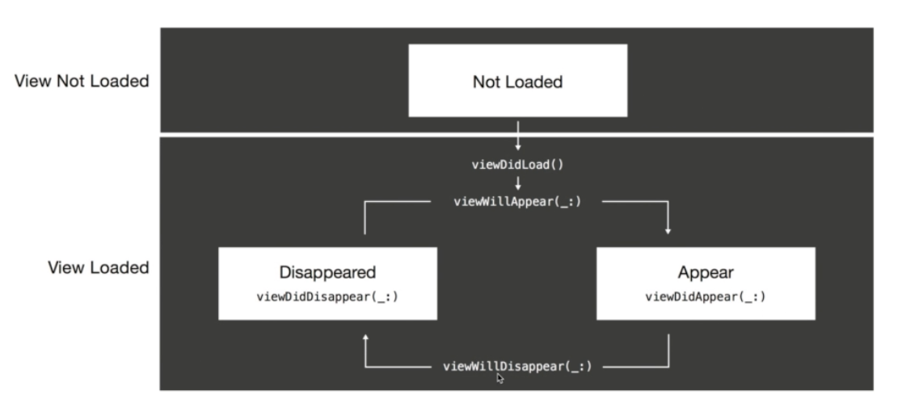
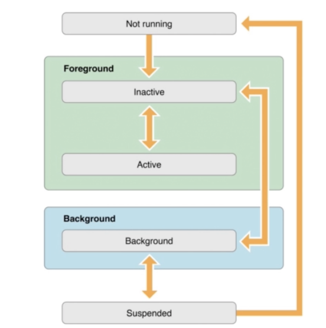
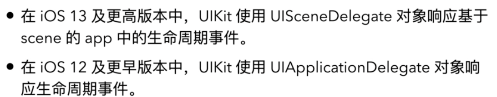
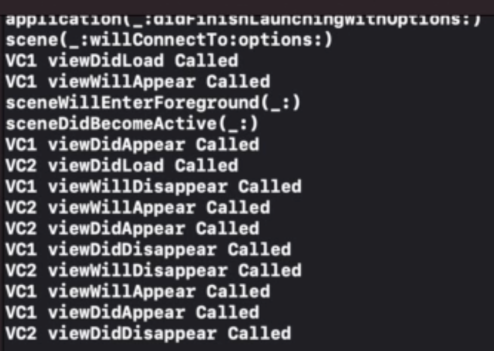
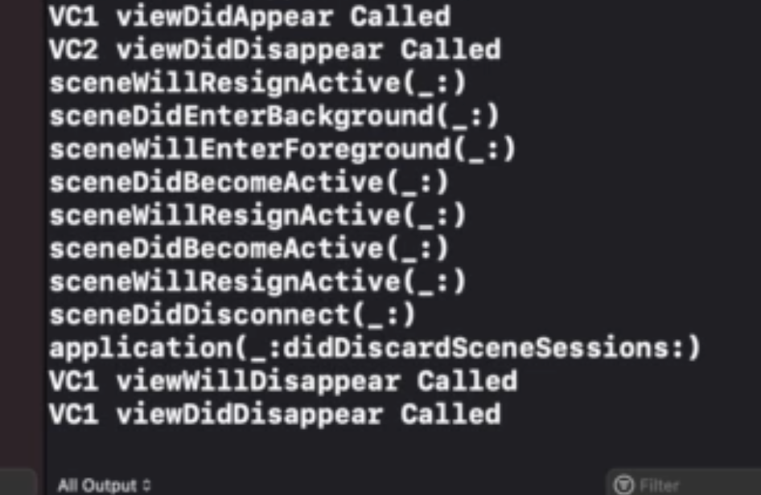

# 20210612 Notes

# Swift 开发 进阶

- UIKit
- Auto Layout
- Model View Controller
- Segues and Navigation Controllers
- View Controller Life Cycle
- App Anatomy and Life Cycle

##### UIKit

- 专门为iOS开发的基本框架 相当于macOS开发中的 AppKit
- 包含常用的 视图 和 控制器
- 构建用户界面的基本框架

常见视图：

- UILabel：一串文本
- UIImageView：展示图片用
- UITextView：多行文本框，如 邮件正文, 可以输入文字
- UIScrollView：容器，包裹其他，显示更大的内容 放大缩小滚动
- UITableView：垂直的列表 分栏目 列表settings

常见控制器：

- UIButton：按钮，样式多
- UISegmentedControl：分段 分页面按钮
- UITextField：单行文本框 用户登录界面
- UISlider：控制条 
- UISwitch：开关

##### AutoLayout

AuroLayout demo：

按钮放在正中间，更改设备型号，位于正中间的按钮就不在中间了。因为没有添加约束，则按距离左上角位置作为定位。选择子窗口中右下角 倒数第四个按钮，添加水平和垂直居中定位约束。再添加一个标签，如果希望其于按钮下，可以添加同样的水平居中约束，用倒数第三个按钮到四周的距离 约束，选择距离button50单位，添加约束。label定位成功。

##### 框架设计模式 Model View Controller MVC

M：程序需要操作的数据和信息

V：视图 程序的外壳 提供给用户操作的界面

C：控制器 根据用户View输入的指令 选取Model中的数据，然后对其进行相应的操作产生最终的结果

将数据 与 界面 分离， 有利于组织项目结构

##### segues and navigation controllers

界面之间跳转：

demo：

新建一个project，seguesDemo。storeboard，点击添加控件，选择viewController拖进来。在第一个vc中添加一个btn，选中btn 按住ctrl按键拖到另一个vc中，show segue的类型，运行检验。下拉回撤。

层级页面：nav，点击第一个vc，右下方第一个按钮navigation controller。

##### vc生命周期

控制器通常有几个状态：

- not loaded
- appearing
- appeared
- disappearing
- disapeared

demo:

初始化 进入一个vc ：viewdidload  viewwillappear  viewdidappear

点击进去另一个vc ： 2viewdidload 1viewwilldisppear 2viewwillappear 2viewdidappear 1viewdiddisappear

返回第一个vc：不需要viewdidload 2 1 1 2四步如上

##### App Anatomy and life cycle

app有哪几个状态：

- not running
- inactive 在前台 不触摸 短暂 切换过度
- active
- background

IOS 1

app launch

scene will connect

vc1 didload

vc1 willappear

scene willenterforeground

scene didactive

vc1 didappear

......

上划返回桌面过程中，will resign active

回到了桌面：did enter background

再次点击：enter foreground + did active

上划不松手 回来：will resign active + did active

多任务划出杀死：will resign active + did disconnected + 

​								app did discard scene sessions  + vc will disappear + vc did disappear

